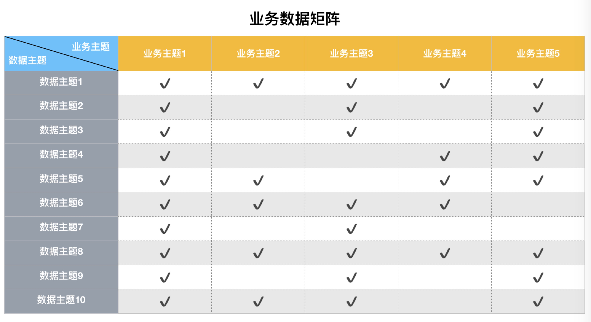
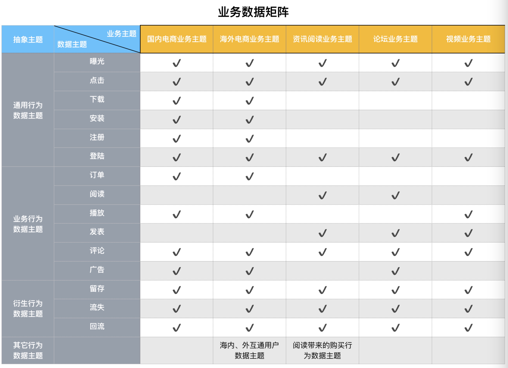

> 怀疑有如草木之芽，从真理之根萌生...

## 0x00 概述

数据仓库的设计不能完全依赖于业务的需求，但又必须服务于业务的价值。那么，该如何地从业务的角度出发，设计一套切实可行的数据仓库呢？

本文将分享数据仓库实践中的**业务数据矩阵的设计**经验，帮助大家在工作中快速理解业务并规划数据仓库体系。

本文将包含如下三部分内容：

1. 分享业务数据仓库的概念的作用
2. 举个栗子说明
3. 一些思考

## 0x01 业务数据矩阵

那么，什么是业务数据矩阵，它又有什么用呢？

**业务数据矩阵**，我们可以认为它的作用是从全局的角度来对公司的数据进行规划和设计。一般来讲，在数据仓库的设计初期，数据仓库架构师会根据对业务和数据的理解来设计一个全局的业务数据矩阵，以此从宏观的角度来描述公司的业务和数据现状，并指导后续的数据仓库建模。

如下表，是业务数据矩阵的表示方法，其中每一列是一个业务主题，每一行是一个数据主题。

- 业务主题：我们可以将一个业务主题理解为公司的一条业务线，或者说数据仓库仓库待建设的一个数据集市。
- 数据主题：一般来讲，我们会侧重于将数据主题理解为行为数据主题，比如说登陆、点击、下载等行为主题。

如果了解了什么是业务数据矩阵，那么它的作用就很容易被理解。简单来讲：

1. 能够帮助数据仓库架构师清晰地梳理整个数据体系。
2. 能够帮助决策者（各位老板）从宏观的角度了解数据仓库的整体情况。
3. 能够让所有的数据仓库参与者了解数据仓库的设计，根据矩阵有规划地填充数据表即可。

## 0x02 举个栗子

趁热打铁，居士举一个栗子来说明业务数据矩阵的设计。

**业务背景**：

假设你是某电商网站的数据仓库架构师，公司的业务和某宝相似，有主营的电商业务，也有资讯阅读类业务、论坛业务和视频业务（比如拆箱导购视频）等。具体的业务就不多描述，简单的想象一下即可。

**数据背景**：

在上面不同的业务中，有几种类型的数据：通用行为数据、业务强相关的数据、通用行为衍生出的行为数据以及其它不易划分的数据：

- 通用行为数据主题：即各业务场景都容易出现行为，比如曝光、点击和下载等。
- 业务行为数据主题：主要是指和业务强相关的行为，比如说视频业务中有播放行为，论坛业务中发表帖子行为。
- 衍生行为数据主题：主要是指非用户原始的行为，比如说留存，本身是由用户活跃来描述的。
- 其它行为数据主题：有一些多主题交叉的数据，比如跨业务主题的海内外互通用户主题，或者跨业务和行为的阅读带来的购买行为数据主题。

**设计思路**：

有了业务背景和数据背景，我们就可以将整个数据体系按照矩阵的方式展现出来，凡是存在的主题，打勾即可。

比如国内和海外的电商业务都有订单相关的数据主题，那在这两项打勾即可。

根据上面的描述，一个业务数据矩阵的设计就可以出来了。如下表。

## 0x03 思考

如同该系列的其它文章一样（可参考https://github.com/dantezhao/data-warehouse ），本文也会从不同的角度来思考和总结业务数据矩阵的设计方法和原则。

### 业务数据矩阵的适用范围

从个人的角度来看，居士认为，业务数据矩阵的数据主要集中的数据分层中的DWD和DWM层，具体的分层可参考《一种通用的数据仓库分层方法》。因为在DWD和DWM层的数据的聚合程度相对较低，数据主题可以从行为的角度来切分，在DWS层的话，大部分数据的都会被整合起来。以国内电商业务主题为例，DWS层的数据表相对来讲就会少很多，该层的用户维度的相关表可能只有一到两张，大部分的行为都会被放入这一到两张表中。

另外，该矩阵更多地是作用于设计阶段，到具体的数据建模过程，表中的对勾可以替换成一张张的表名，比如国内电商业务的订单数据主题中，可能就会有多张表DWD和DWM的表。

### 主题划分的方法

主题划分是指两部分：行为主题和业务主题。不同的场景的有不同的划分方式，或者说不同的阶段也有不同的划分方式。

首先说行为主题，本文所举的例子未必是最合适的，比如留存和流失这些内容，其实也可以放在登陆数据主题中，因为一般的留存是按照是否登陆来判断的。这里需要根据具体的业务场景来对数据进行划分。

然后是业务主题的设计，本文的例子是根据公司的业务来划分主题的，即一个大的业务为一个业务主题。这里当然可以更细致来进行划分，比如把一个使用场景当作一个业务主题，比如买家和卖家对话可以是一个业务主题。

前面的设计比较偏向于DWM层。那么在数据集市层，也可以按照不同的数据集市来划分业务主题。

## 0xFF 总结

以上，主要是居士工作中总结的一种设计方法，暂无理论的支持。有相关经验的小伙伴可以交流一下。

然后补充一个业务数据矩阵的使用场景，该矩阵可以当作是数据项目的进度表来用，在矩阵里面写上负责人，和完成时间，这样可以方便定期的项目Review和汇报。

