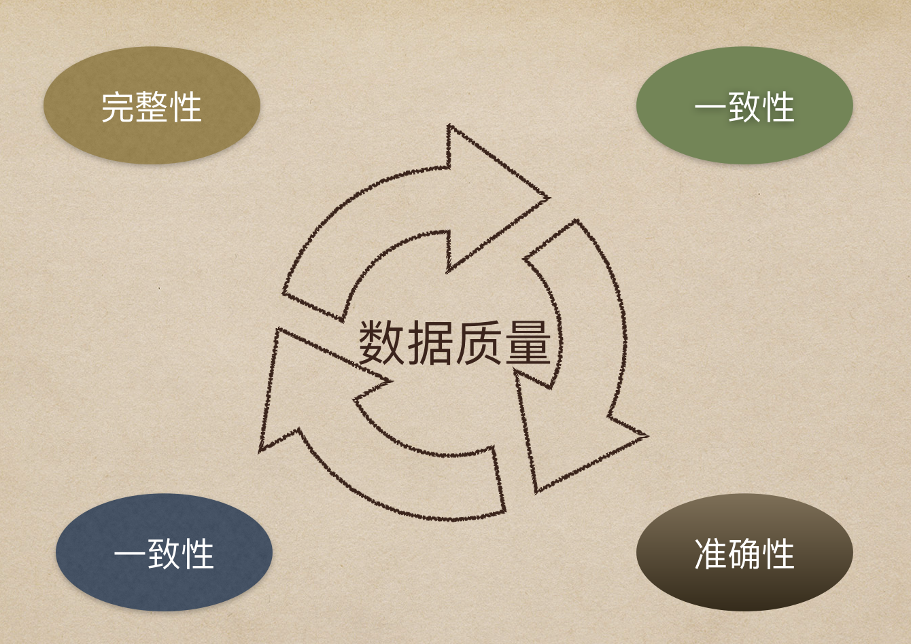
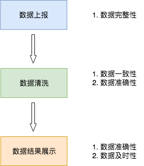
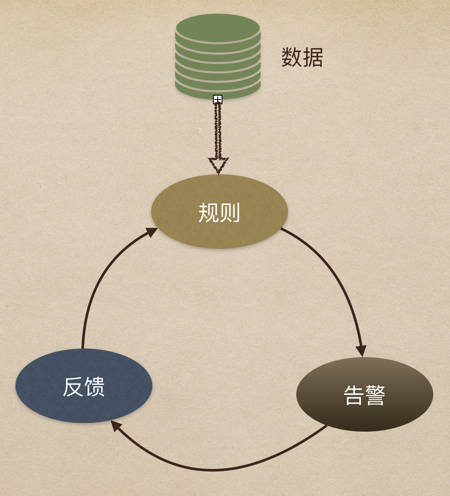

> 与其有时间抱怨，还不如去行动。

## 0x00 概述

随着大数据时代的带来，数据的应用也日趋繁茂，越来越多的应用和服务都基于数据而建立，数据的重要性不言而喻。**而且，数据质量是数据分析和数据挖掘结论有效性和准确性的基础，也是这一切的数据驱动决策的前提！**如何保障数据质量，确保数据可用性是每一位数据人都不可忽略的重要环节。

**数据质量，主要从四个方面进行评估，即完整性、准确性、一致性和及时性，本文将会结合业务流程和数据处理流程，对这个四个方面进行详细的分析和讲解。**

数据，最终是要服务于业务价值的，因此，本文不会单纯讲解理论，而是会从数据质量监控这一数据的应用为出发点，为大家分享居士对数据质量的思考。通过本文，你将获得如下几方面的知识点：

1. 数据质量核心关注的要点
2. 从数据计算链条理解，每一个环节会出现哪些数据质量问题
3. 从业务逻辑理解，数据质量监控能带来的帮助
4. 实现数据质量监控系统时要关注的点
5. 数据质量监控面临的一些难点和解决思路

## 0x01 四大关注点

本节，先简单地聊一下数据质量需要关注的四个点：即完整性、准确性、一致性和及时性。这四个关注点，会在我们的数据处理流程的各个环节有所体现。

#### 一、完整性

完整性是指数据的记录和信息是否完整，是否存在缺失的情况。数据的缺失主要包括记录的缺失和记录中某个字段信息的缺失，两者都会造成统计结果不准确，所以说完整性是数据质量最基础的保障。

简单来讲，如果要做监控，需要考虑两个方面：一是，数据条数是否少了，二是，某些字段的取值是否缺失。完整性的监控，多出现在日志级别的监控上，一般会在数据接入的时候来做数据完整性校验。

#### 二、准确性

准确性是指数据中记录的信息和数据是否准确，是否存在异常或者错误的信息。

直观来讲就是看数据是否上准确的。一般准确性的监控多集中在对业务结果数据的监控，比如每日的活跃、收入等数据是否正常。

#### 三、一致性

一致性是指同一指标在不同地方的结果是否一致。

数据不一致的情况，多出现在数据系统达到一定的复杂度后，同一指标会在多处进行计算，由于计算口径或者开发人员的不同，容易造成同一指标出现的不同的结果。

#### 四、及时性

在确保数据的完整性、准确性和一致性后，接下来就要保障数据能够及时产出，这样才能体现数据的价值。

及时性很容易理解，主要就是数据计算出来的速度是否够快，这点在数据质量监控中可以体现在监控结果数据数据是否在指定时间点前计算完成。

## 0x02 数据处理各环节的数据质量

数据质量监控之所以难做，是因为在数据的各个环节都会出现数据质量的问题。因此，本节将以一个典型的数据处理链条为例，为大家分享在每个阶段容易出现哪些数据质量问题。

如下图，为了举例说明，我画了一个简单的数据处理流程（*在实际中的情况会比该情况复杂很多*），我将数据处理分为 3 个阶段：数据接入、中间数据清洗、结果数据计算。

### 数据接入

如上图所示，数据接入环节最容易出现的是数据完整性的问题，这里要特别注意的是数据量是否陡增和陡降。

陡增意味着可能会出现大量数据重复上报或者异常数据侵入等情况，陡降意味着可能出现数据丢失的情况。

另一方面，也要检查不同字段的的取值是否有丢失，比如地址和设备字段是否出现大量空值等异常。

### 数据清洗

在这里，我将数据清洗的范围局限在数据仓库的中间表清洗上，这一部分一般也是我们的数据仓库要建设的核心部分，业务到了一定程度，数据中间层的建设必不可少！

在这一环节，最容易出现的是数据一致性和数据准确性的问题。数据中间层保障来数据是从统一出口而出，让数据一起对或者一起错。但是很难保证数据准确性的问题，因此在数据清洗阶段需要尽量保障数据的准确性。

### 数据结果

结果数据，主要是强调对外提供数据的过程，一般是从中间表中计算或直接取得的可展示数据。这里是业务方和老板最容易感知的到的地方，因此在这环节，主要关注的是数据准确性和数据及时性。

**整体来讲，数据的完整性、准确性、一致性和及时性在数据处理的各个阶段都需要关注，但是可以先抓住的核心的问题来解决。**

## 0x03 业务流程各环节的数据质量

聊完数据处理，我们继续聊一下业务流程。数据最终的价值是要服务于业务的，因此数据质量最好也是能从解决业务问题出发，因此，本节从典型的业务场景来讲解数据质量该怎么做。

首先，居士认为，既然做监控肯定是要考虑使用方的，而我们的数据质量监控平台一个很重要的作用是希望让老板、产品和运营这些使用方对我们的数据放心，那么他们的关注点是什么？居士认为，是业务指标！

那么，这个业务指标可以从两个角度来考虑：

1. 单个指标的数值异常，比如说数据是否达到来某个临界值？是否有陡增和陡降？
2. 整个业务链条的数据是否有异常，比如从曝光到注册的转化是否有异常？

如下图，是一个 App 的用户行为漏斗分析，其实也就是从获取用户到转化的简单链路。

那么针对该链路，我们数据质量监控要做的事，除了告诉使用方某一个节点的值有问题，也需要告诉他们整个链条哪里出了问题，哪里的转化低了。

## 0x04 如何实现数据质量监控

前面分享了数据质量关注的点，以及从技术和业务角度会如何关注数据质量，本节将简单地分享一下如何实现数据质量监控。这里将分两个角度：宏观的设计思路和技术实现思路。

### 一、设计思路

数据质量监控的设计要分为四个模块：数据、规则、告警和反馈。

- 数据：主要是需要被数据质量监控到的数据，数据可能存放在不同的存储引擎中，比如Hive、PG、ES等。

- 规则：是指如何设计发现异常的规则，一般而言主要是数值的异常和环比等异常监控方式。也会有一些通过算法来发掘异常数据的方法。
- 告警：告警是指出发告警的动作，这里可以通过微信消息、电话、短信或者是微信小程序的方式来触发告警内容。
- 反馈：这里需要特别注意，反馈是指对告警内容的反馈，比如说收到的告警的内容，那么负责人要来回应这个告警消息是否是真的异常，是否需要忽略该异常，是否已经处理了该异常。有了反馈的机制，整个数据质量监控才容易形成闭环。更能体现业务价值。

### 二、技术方案

关于技术方案，这里不多描述细节，因为不同的公司和团队情况对实现方案的考虑是不同的，简单做的话，可以写一些定时脚本即可，复杂的话可以做成一个分布式的系统。这里也可以参考居士17年写的一部分内容[《漫谈数据质量监控》](https://mp.weixin.qq.com/s/VZMhbha3sjxxNFTcIGYESw)。

本篇只简单说明几个技术实现中需要关注的点：

1. 最开始可以先关注核心要监控的内容，比如说准确性，那么就对核心的一些指标做监控即可，不用开始就做很大的系统。
2. 监控平台尽量不要做太复杂的规则逻辑，尽量只对结果数据进行监控。比如要监控日志量是否波动过大，那么把该计算流程前置，先计算好结果表，最后监控平台只监控结果表是否异常即可。
3. 多数据源，多数据源的监控有两种方式可以处理：针对每个数据源定制实现一部分计算逻辑，也可以通过额外的任务将多数据源中的数据结果通过任务写入一个数据源中，再该数据源进行监控，这样可以减少数据监控平台的开发逻辑。具体的优缺点可以自行衡量。
4. 实时数据的监控，实时和离线数据监控的主要区别在于扫描周期的不同，因此在设计的时候可以先以离线数据为主，但是尽量预留好实时监控的设计。
5. 在设计之初，尽量预留好算法监控的设计，这是一个很大的加分项，具体的结合方式也可以和第二点建议接近，比如算法异常数据放到一张结果表中，再在上面配置简单的告警规则即可。

## 0x05 一些困难

在做数据质量监控的时候难免会遇到一些困难点，亦或是被老板挑战的地方，下面列举几个问题和解决的思路，供大家参考：

**问题**一：假设你的结果表要经过多层的中间表计算，你怎么保证每个环节都是正确的，且最终结果是正确的？

**思路**：从两个点考虑：

1. 每一层代码有 Code Review，保证代码逻辑正常。
2. 单独一条计算流，对关键指标从原始数据直接计算结果，和日常的结果表做对比，发现不同则告警。这种方式也可以理解为是结果数据和源数据的对账。

**问题二**：告警信息太多了，太容易被忽略怎么办？

**思路**：主要是思路是提高告警的准确率，避免无用的告警，有三个思路：

1. 多使用机器学习算法的方式来发现异常点，比如：异常森林。
2. 加入反馈机制，如果业务负责人认为该告警是正常的，就打上正常的tag，后续告警规则根据反馈进行优化。
3. 加入屏蔽功能，屏蔽不感兴趣的告警。

## 0xFF 总结

和本系列其它文章相似，本文更侧重的是做数据质量过程的思考，这个思考主要体现的地方是，怎么去定义问题和解决问题，而不是直接给出解决的方案。

比如说从数据流程的各个环节来梳理需要做数据质量的点，以及业务方核心会关注的点，这些才是能决定你的数据质量监控平台能否获得认可的关键因素。当这些东西都理清之后，技术实现只是把你的想法具像化的工具，这并非是不重视技术，而是更看重如何让技术的价值最大化。

最后，欢迎大家多多交流。