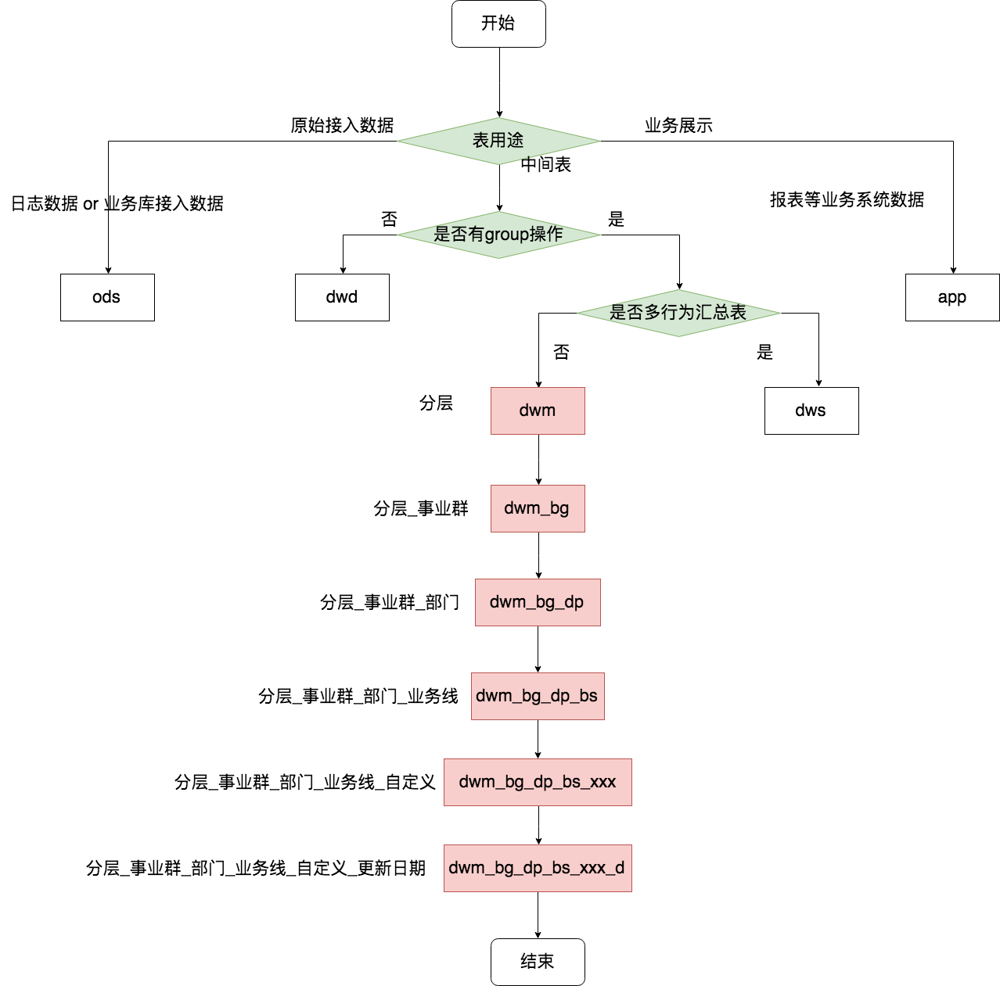

> 笨蛋自以为聪明，聪明人才知道自己是笨蛋。

## 0x00 前言

数据仓库的实施和落地需要团队中不同成员的参与和配合，因此也需要各种各样的规范，其中最典型的就是表命名规范，规范的表命名能让使用者轻而易举地明白该表的作用和含义。

但是，在实际的落地实施中，经常会出现各种不规范的命名例子，同时也会伴随着各种各样的疑问。比如说：

- "画像表该如何命名？"
- "表名到底要包含多少信息？"
- "我这张表该放在app层还是dws层？"。

如何解决上面这些问题，就是本篇的重点：**如何设计可落地执行的表命名规范！**

## 0x01 关注点

### 一、数据分层

表命名规范的设计，本身其实是一件很简单的事情，但是它却依赖于不少其它外部信息，其中，数据分层是最为重要的地方。但是，一旦数据粉刺有了清晰的边界，表规范的设计就很会容易很多。关于数据分层相关的文章，请参考【[一种通用的数据仓库分层方法](./data-layer-of-the-data-warehouse.md)】。

### 二、其它关注点

在数据分层之外，也有很多其它需要关注的点，比如说：

1. BG和部门的划分
2. 业务线的划分
3. 数据的更新日期
4. 数据的用途

需要关注的点可以有很多，但是在具体设计的时候，可以适当做一些取舍，只规范核心和重要的即可。关于业务划分的文章请参考【[数据仓库实践之业务数据矩阵的设计](./the-design-of-business-data-matrix.md)】。

### 三、一定要有明确的界限！

规范设计，表面上很简单，但是背后需要思考的地方却很多。比如说数据分层，以《一种通用的数据仓库分层方法》为例，文中的dwd层和dwm的明确界限是否能列举出来，直接决定了大家新建一张表时能否将它放在正确的位置的。同样，dwm和dws好的明确界限是什么，dws和app层的明确界限又是什么。

当这些设计和规范都存在模糊的时候，大家首先就会不明白该把表放在哪个分层里面，更不用说来确定命名了。

关于分层之间的明确界限这里先不做过多解释，本文默认读者在设计分层的时候已经考虑好了明确的划分界限，在此基础上，我们只需要将该划分界限以一种优雅的方式展示出来即可。

## 0x02 举个例子

如下图，举个例子来说明，该图中的命名规范和《一种通用的数据仓库分层方法》一一对应。

该例，以流程图的方式来展示，更加直观和易懂，本图侧重dwm层表的命名规范，其余命名是类似的道理：

1. 第一个判断条件是该表的用途，是中间表、原始日志还是业务展示用的表
2. 如果该表被判断为中间表，就会走入下一个判断条件：表是否有group操作
3. 通过是否有grouo操作来判断该表该划分在dwd层还是dwm和dws层
4. 如果不是dwd层，则需要判断该表是否是多个行为的汇总表（即宽表）
5. 最后再分别填上事业群、部门、业务线、自定义名称和更新频率等信息即可。

## 0x03 思考

表命名，其实在很大程度上是对元数据描述的一种体现，表命名规范越完善，我们能从表名获取到的信息就越多。以上图为例，我们单纯从表中就能获得如下信息：

- 分层：表的使用范围
- 事业群和部门：生产该表或者该数据的团队
- 业务线：表明该数据是哪个产品或者业务线相关
- 自定义：一般会尽可能多描述该表的信息，比如活跃表、留存表等
- 更新周期：比如说天级还是月级更新

这里只列举部分信息，有一些也是可以加入表命名中，比如说表的类型说增量更新还是全量更新，自定义命名部分更细致的划分等等。

## 0xFF 总结

**为什么会有这样一张流程图来规划表的命名？**

居士认为，所有的规范都需要有可落地执行的边界，同时这个边界一定说要让遵从着不需要太懂脑子去理解和思考，最好看一眼就知道该怎么去做。一旦你的规范有模糊的地方，那么别人就可以去挑战甚至不服从。

同样，这样的问题和解决方式也存在于各个地方中，比如上报数据的规范、字段命名的规范等等。